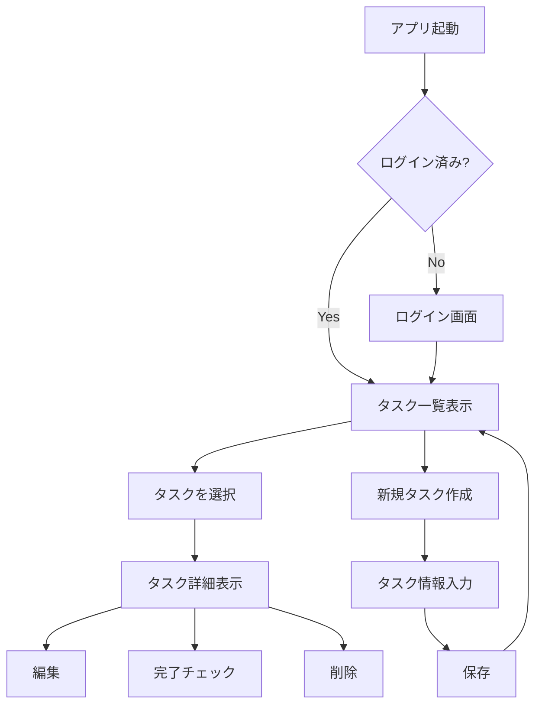
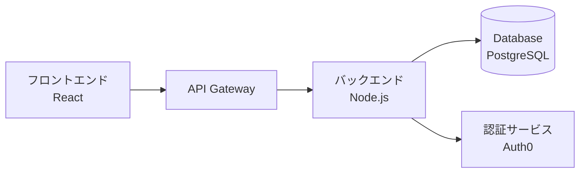
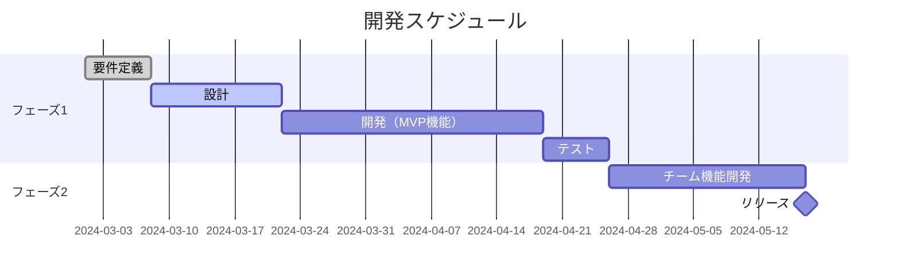
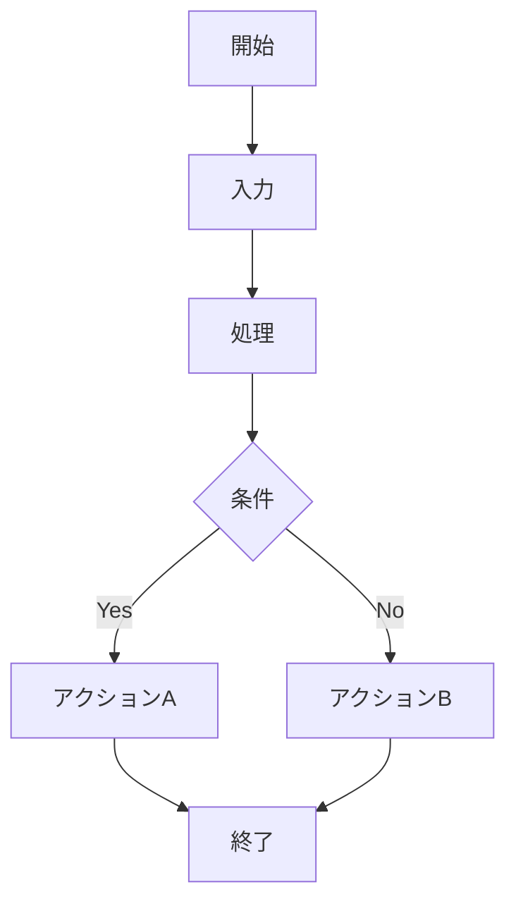
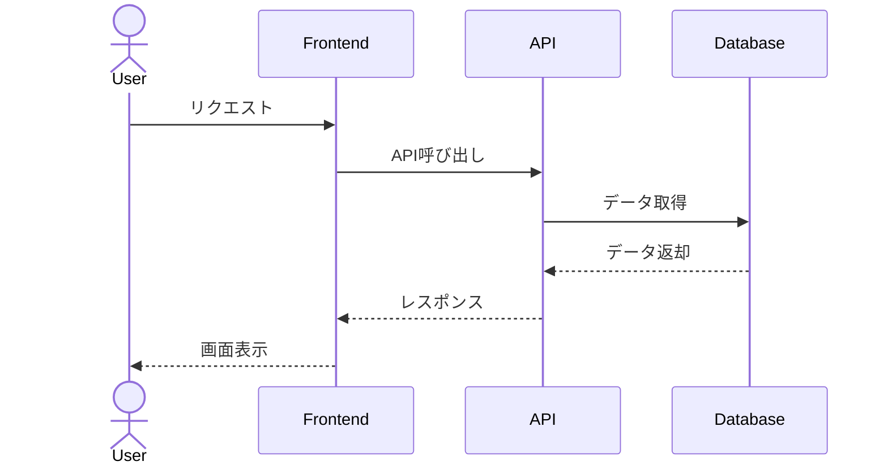
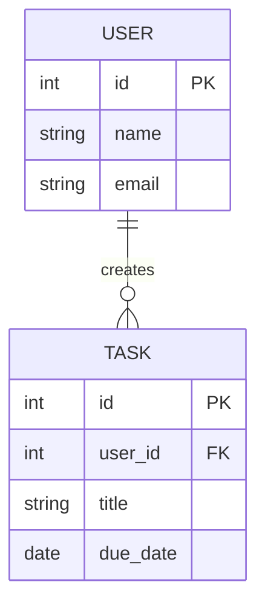

# PRD Create

プロダクト要件定義書（Product Requirements Document）を作成します。
ユーザーと対話しながら情報を収集し、適切な構成とMermaid図で視覚的にわかりやすいドキュメントを生成します。

## 使用方法

```
/prd-create [プロダクト名やアイデア]
```

**例:**
```
/prd-create
/prd-create "タスク管理アプリ"
/prd-create "ECサイトのチェックアウトフロー改善"
```

## 実行手順

### 1. 初期情報の収集

ユーザーから以下の情報を収集します：

**必須情報:**
- プロダクト名/機能名
- 概要（何を作るのか）
- 目的（なぜ作るのか）
- ターゲットユーザー

**任意情報:**
- 背景・課題
- 主要機能
- 制約条件
- スケジュール感

**収集方法:**
- 引数で提供されている場合はそれをベースに質問
- 不足している情報を対話で確認
- 「詳細は後で決める」でもOK（AIが仮の内容を提案）

**質問例:**
```
以下の情報を教えてください：

1. プロダクト名: [ユーザー入力]
2. 概要: どのようなプロダクト/機能ですか？
3. 目的: なぜこれを作るのですか？解決したい課題は？
4. ターゲットユーザー: 誰が使いますか？

※ わからない項目は「未定」と答えていただければ、後で一緒に考えます。
```

### 2. 要件の深掘り

収集した情報から、PRDに必要な詳細を対話で確認：

**機能要件:**
- 主要な機能は？（MVP として必要な最小限の機能）
- 優先度の高い順に3-5個程度

**非機能要件:**
- パフォーマンス要件（応答速度、処理時間など）
- セキュリティ要件
- スケーラビリティ
- 使いやすさ（UX要件）

**技術制約:**
- 使用する技術スタック（既に決まっていれば）
- 既存システムとの連携
- 予算・リソース制約

**対話のポイント:**
- ユーザーが明確に答えられない場合は、AIが選択肢を提案
- 「よくある要件」を提示して選んでもらう
- 必要に応じて追加質問

### 3. PRD構成の決定

収集した情報から、適切なPRD構成を決定します：

**基本構成:**
1. **概要**
   - プロダクト名
   - 簡潔な説明（1-2文）

2. **背景と目的**
   - 解決したい課題
   - なぜ今作るのか
   - 期待される効果

3. **ターゲットユーザー**
   - ユーザーペルソナ
   - ユーザーストーリー

4. **機能要件**
   - 主要機能の詳細
   - 優先度付き

5. **非機能要件**
   - パフォーマンス
   - セキュリティ
   - その他

6. **技術仕様** (必要に応じて)
   - アーキテクチャ
   - 技術スタック

7. **スケジュールとマイルストーン** (提供されていれば)

**Mermaid図の選定:**

プロダクトの特性に応じて適切な図を選択：

- **フローチャート** (`graph` / `flowchart`): ユーザーフロー、処理フロー
  - 例: ログインフロー、購入フロー、承認プロセス

- **シーケンス図** (`sequenceDiagram`): システム間の相互作用
  - 例: API通信、認証フロー、データ同期

- **状態遷移図** (`stateDiagram`): ステータス管理が重要な場合
  - 例: 注文ステータス、タスク状態、承認ワークフロー

- **ER図** (`erDiagram`): データモデルが複雑な場合
  - 例: データベース設計、エンティティ関係

- **クラス図** (`classDiagram`): オブジェクト指向設計
  - 例: システムアーキテクチャ、モジュール構成

- **ガントチャート** (`gantt`): スケジュール管理
  - 例: マイルストーン、フェーズごとの計画

**判断基準:**
- ユーザーフローが重要 → フローチャート
- システム連携が多い → シーケンス図
- データ構造が複雑 → ER図
- 段階的な状態変化がある → 状態遷移図
- スケジュールが明確 → ガントチャート

複数の図を組み合わせてもOK。

### 4. PRDの生成

収集した情報とMermaid図を組み合わせて、PRDを生成します。

**ファイル名の決定:**
- `docs/PRD.md` (デフォルト)
- プロダクト名から生成: `docs/PRD-product-name.md`
- ユーザーに確認

**PRD例:**

````markdown
# PRD: タスク管理アプリ

## 概要

個人・チーム向けのシンプルなタスク管理アプリ。直感的なUIで素早くタスクを追加・管理できる。

## 背景と目的

### 課題
- 既存のタスク管理ツールは機能が多すぎて使いづらい
- シンプルに「やることリスト」を管理したいニーズがある

### 目的
- 誰でも5分で使い始められるタスク管理ツールを提供
- モバイルでも快適に使える

### 期待される効果
- タスク管理の習慣化
- チームの生産性向上

## ターゲットユーザー

### プライマリーユーザー
- 年齢: 20-40代
- 職業: オフィスワーカー、フリーランス
- 特徴: デジタルツールに慣れている、シンプルさを好む

### ユーザーストーリー

1. **個人ユーザー**
   - 「朝、今日やることリストを確認したい」
   - 「完了したタスクにチェックを入れたい」
   - 「明日以降のタスクも見たい」

2. **チームリーダー**
   - 「チームメンバーのタスクを確認したい」
   - 「誰が何をやっているか可視化したい」

## 機能要件

### MVP機能（優先度: 高）

1. **タスク作成・編集・削除**
   - タイトル、説明、期限を設定
   - タグ・ラベルで分類

2. **タスク一覧表示**
   - 今日・明日・今週・すべて のフィルター
   - ステータス（未着手・進行中・完了）で絞り込み

3. **チェックボックスでの完了管理**
   - ワンクリックで完了/未完了を切り替え

### フェーズ2機能（優先度: 中）

4. **チーム機能**
   - チームメンバーの追加
   - タスクの担当者設定

5. **通知機能**
   - 期限前のリマインダー

## ユーザーフロー



## システム構成



## 非機能要件

### パフォーマンス
- タスク一覧の表示: 1秒以内
- タスクの作成・更新: 0.5秒以内

### セキュリティ
- JWT認証
- HTTPS通信
- データ暗号化

### スケーラビリティ
- 初期: 1万ユーザー対応
- 将来: 10万ユーザーまで拡張可能

### UX要件
- モバイルファースト設計
- オフライン対応（将来的に）

## 技術仕様

### フロントエンド
- React + TypeScript
- TailwindCSS

### バックエンド
- Node.js + Express
- PostgreSQL

### インフラ
- Vercel (フロントエンド)
- AWS Lambda (バックエンド)
- RDS (データベース)

## スケジュールとマイルストーン



## リスクと対策

| リスク | 影響度 | 対策 |
|--------|--------|------|
| 技術スタックの習熟不足 | 中 | 事前学習期間を設ける |
| スケジュール遅延 | 高 | MVPを最小限に絞る |
| ユーザー獲得難 | 中 | 早期ベータテスターを募集 |

## 成功指標（KPI）

- DAU: 1,000ユーザー（3ヶ月後）
- タスク完了率: 70%以上
- ユーザー継続率: 50%（1ヶ月後）

---

作成日: 2024-03-01
作成者: [名前]
バージョン: 1.0
````

### 5. ユーザー確認

生成したPRDをユーザーに提示：

```
以下の内容でPRDを作成しました：

【ファイル名】
docs/PRD-task-management.md

【内容プレビュー】
- 概要
- 背景と目的
- ターゲットユーザー
- 機能要件（MVP + フェーズ2）
- ユーザーフロー図（Mermaid）
- システム構成図（Mermaid）
- 非機能要件
- 技術仕様
- スケジュール（ガントチャート）
- リスクと対策
- 成功指標

このままファイルを作成してよろしいですか？
修正したい箇所があれば教えてください。
```

### 6. ファイル作成

ユーザーが承認したら、ファイルを作成：

```bash
# docsディレクトリがなければ作成
mkdir -p docs

# PRDファイルを作成
Write tool を使用
```

### 7. 完了報告

```
✓ PRDを作成しました！

【ファイル】
docs/PRD-task-management.md

【含まれる図】
- ユーザーフロー図（flowchart）
- システム構成図（graph）
- スケジュール（gantt）

【次のステップ】
1. PRDをチームでレビュー
2. 必要に応じて修正
3. 開発着手

Mermaid図はGitHub、Notion、VS Codeなどで自動レンダリングされます。
```

## Mermaid図の例

### フローチャート


### シーケンス図


### ER図


## コンテキスト最適化

このスキルは以下の方針でコンテキストを最適化しています：
- ファイル作成は Write ツールを使用
- SKILL.md には対話ロジックとPRD生成のロジックのみ記述
- テンプレートは動的に生成（固定ファイル不要）
- Mermaid図の選定はプロダクト特性に応じて自動判断

## 注意事項

- PRDの詳細度はプロダクトの複雑さに応じて調整されます
- Mermaid図は必須ではありません（必要に応じて追加）
- 既存のPRDファイルがある場合は上書き確認を行います
- バージョン管理のため、日付やバージョン番号を含めることを推奨します
- このスキルは初期のPRD作成をサポートするもので、継続的な更新は手動で行ってください
